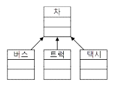
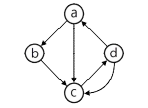
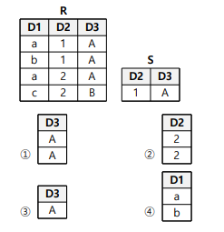
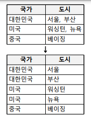

# 2020년 3월 기출 오답노트( + 헷갈리는 문제)

## 1. 소프트웨어 설계 - 3문제 틀림

3. 럼바우 객체 지향 분석과 거리가 먼 것은? (4) 맞은 문제

    ① 기능 모델링 ② 동적 모델링 ③ 객체 모델링 ④ 정적 모델링

5. 미들웨어 솔루션의 유형에 포함되지 않는 것은? (2)

    ① WAS ② Web Server ③ RPC ④ ORB

6. UML에서 시퀀스 다이어그램의 구성 항목에 해당하지 않는 것은? (3) 맞은 문제

   ① 생명선 ② 실행 ③ 확장 ④ 메시지

8. 디자인 패턴 중에서 행위적 패턴에 속하지 않는 것은? (3)

   ① 커맨드(Command) 패턴 ② 옵저버(Observer) 패턴 ③ 프로토타입(Prototype) 패턴 ④ 상태(State) 패턴

14. 아래의 UML 모델에서 '차' 클래스와 각 클래스의 관계로 옳 은 것은? (3) `->` 화살표는 일반화 관계

    

    ① 추상화 관계 ② 의존 관계 ③ 일반화 관계 ④ 그룹 관계

18. 자료흐름도(Data Flow Diagram)의 구성요소로 옳은 것은? (2)

     ① process, data flow, data store, comment ② process, data flow, data store, terminator ③ data flow, data store, terminator, data dictionary ④ process, data store, terminator, mini-spec

20. 인터페이스 요구 사항 검토 방법에 대한 설명이 옳은 것은? (2) 맞은 문제

    ① 리팩토링 : 작성자 이외의 전문 검토 그룹이 요구사항 명세 서를 상세히 조사하여 결함, 표준 위배, 문제점 등을 파악 ② 동료검토 : 요구 사항 명세서 작성자가 요구 사항 명세서를 설명하고 이해관계자들이 설명을 들으면서 결함을 발견 ③ 인스펙션 : 자동화된 요구 사항 관리 도구를 이용하여 요구 사항 추적성과 일관성을 검토 ④ CASE 도구 : 검토 자료를 회의 전에 배포해서 사전 검토한 후 짧은 시간 동안 검토 회의를 진행하면서 결함을 발견

 

## 2. 소프트웨어 개발 - 2문제 틀림

23. 패키지 소프트웨어의 일반적인 제품 품질 요구사항 및 테스 트를 위한 국제 표준은? (3) 맞은 문제

    ① ISO/IEC 2196 ② IEEE 19554 ③ ISO/IEC 12119 ④ ISO/IEC 14959

25. 블랙박스 테스트의 유형으로 틀린 것은? (4) 화이트 - 코드 내의 검사, 블랙 - 코드를 모르는 상태의 검사(사용자 입장)

     ① 경계값 분석 ② 오류 예측 ③ 동등 분할 기법 ④ 조건, 루프 검사

26. 제어흐름 그래프가 다음과 같을 때 McCabe의 cyclomatic 수 는 얼마인가? (2) Edge - Node + 2

    

    ① 3 ② 4 ③ 5 ④ 6

39. 알파, 베타 테스트와 가장 밀접한 연관이 있는 테스트 단계는? (2) 단위 -> 통합 -> 시스템 -> 인수

    ① 단위 테스트 ② 인수 테스트 ③ 통합 테스트 ④ 시스템 테스트

 

## 3. 데이터베이스 구축 - 7문제 틀림

43. Commit과 Rollback 명령어에 의해 보장 받는 트랜잭션의 특 성은? (3) 원자성 - 동시 처리, 지속성, 일관성, 고립성 - 끼어들기x

    ① 병행성 ② 보안성 ③ 원자성 ④ 로그

46. 병행제어 기법 중 로킹에 대한 설명으로 옳지 않은 것은? (4) 로킹 - 트랜잭션 중 걸어 잠궈 한 트랜잭션만 사용할 수 있게 하는 것

    ① 로킹의 대상이 되는 객체의 크기를 로킹 단위라고 한다. ② 데이터베이스, 파일, 레코드 등은 로킹 단위가 될 수 있다. ③ 로킹의 단위가 작아지면 로킹 오버헤드가 증가한다. ④ 로킹의 단위가 커지면 데이터베이스 공유도가 증가한다.

    | **로킹 단위 ** | **로크의 수** | **병행 제어** | **로킹 오버헤드** | **병행성 수준** | **데이터베이스 공유도** |
    | -------------- | ------------- | ------------- | ----------------- | --------------- | ----------------------- |
    | 커짐           | 적어짐        | 단순해짐      | 감소              | 낮아짐          | 감소                    |
    | 작아짐         | 커짐          | 복잡해짐      | 증가              | 높아짐          | 증가                    |

48. 뷰(View)의 장점이 아닌 것은? (1)

    ① 뷰 자체로 인덱스를 가짐 ② 데이터 보안 용이 ③ 논리적 독립성 제공 ④ 사용자 데이터 관리 용이

52. 다음 R과 S 두 릴레이션에 대한 Division 연산의 수행 결과는? (4) 

    

54. 데이터베이스 로그(log)를 필요로 하는 회복 기법은? (1)

    ① 즉각 갱신 기법 ② 대수적 코딩 방법 ③ 타임 스탬프 기법 ④ 폴딩 기법

56. 다음과 같이 위쪽 릴레이션을 아래쪽 릴레이션으로 정규화 를 하였을 때 어떤 정규화 작업을 한 것인가? (1)

​		① 제1정규형 ② 제2정규형 ③ 제3정규형 ④ 제4정규형

57. 관계대수의 순수관계 연산자가 아닌 것은? (2) 순수 - Select, Join, Division, Project

    ① Select ② Cartesian Product ③ Division ④ Project

    Select :

    \- 릴레이션에 존재하는 튜플 중에서 선택 조건을 만족하는 튜플의 부분집합을 구하여 새로운 릴레이션을 만듦

    \- 릴레이션의 행에 해당하는 튜플을 구하는 것이므로 수평 연산이라고도 함 

    \- 연산자의 기호는 그리스 문자 시그마를 사용함

    Project :

    \- 주어진 릴레이션에서 속성 List에 제시된 Attribute 만을 추출하는 연산

    \- 릴레이션의 열에 해당하는 Attribute를 추출하는 것이므로 수직 연산자라고도함

    \- 연산자의 기호는 그리스 문자 파이를 사용

    Join : 

    \- 공통 속성을 중심으로 2개의 릴레이션을 하나로 합쳐서 새로운 릴레이션을 만드는 연산

    \- 연산자의 기호는 >< 세모 두 개 합친 리본 모양

    Division : 

    \- X⊃Y인 2개의 릴레이션 R(X)와 S(Y)가 있을 때 R의 속성이 S의 속성 값을 모두가 가진 튜플에서 

    S가 가진 속성을 제외(분리)한 속성만을 구하는 연산 

 

## 4. 프로그래밍언어 활용 - 2문제 틀림

63. 다음 중 bash 쉘 스크립트에서 사용할 수 있는 제어문이 아 닌 것은? (3) 맞은 문제

    ① if ② for ③ repeat_do ④ while

70. 다음이 설명하는 응집도의 유형은? (4)

    모듈이 다수의 관련 기능을 가질 때 모듈 안의 구성 요소들이 그 기능을 순차적으로 수행할 경우의 응집도

     ① 기능적 응집도 ② 우연적 응집도 ③ 논리적 응집도 ④ 절차적 응집도

72. 다음 중 가장 결합도가 강한 것은? (3)

    ① date coupling ② stamp coupling ③ common coupling ④ control coupling

 

## 5. 정보시스템 구축 관리 - 아직 안배움

